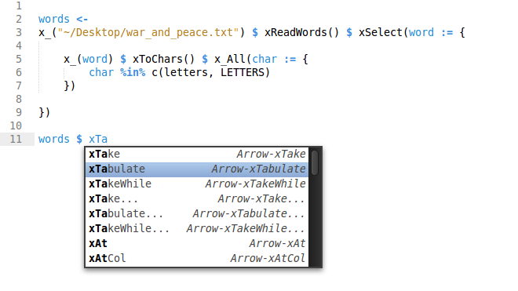

Arrow-Snippets (v0.1)
===========================================


**Arrow-Snippets** serves a very specific purpose. It is a Sublime Text 2/3
package that adds text snippets for every function in the [**Arrow**](https://github.com/rgrannell1/arrow)
functional programming library for the R language. They can be handy for writing long
method chains quickly.

</img>

## 1 Installing

Installing simply involves cloning this repository to your sublime package directory. Depending
on your operating system, you will probably be able to use one of the following:

### Linux

```bash
cd ~/.config/sublime-text-3/Packages
git clone https://github.com/rgrannell1/arrow-snippets.git
```

### OS X

```bash
cd ~/Library/Application\ Support/Sublime\ Text\ 2/Packages
git clone https://github.com/rgrannell1/arrow-snippets.git
```

### Windows

```
cd "%AppData%\Sublime Text 3\Packages\User"
git clone https://github.com/rgrannell1/arrow-snippets.git
```
If for some reason you don't have git installed, you can manually grab the [zip](https://github.com/rgrannell1/arrow-snippets/archive/master.zip) github, and
extract in into the package location for your operating system.

## 2 Authors

Ryan Grannell

## 3 License

As with **Arrow**, **Arrow-Snippets** is released under the terms of the GNU General Public License version 3.

 </img>
